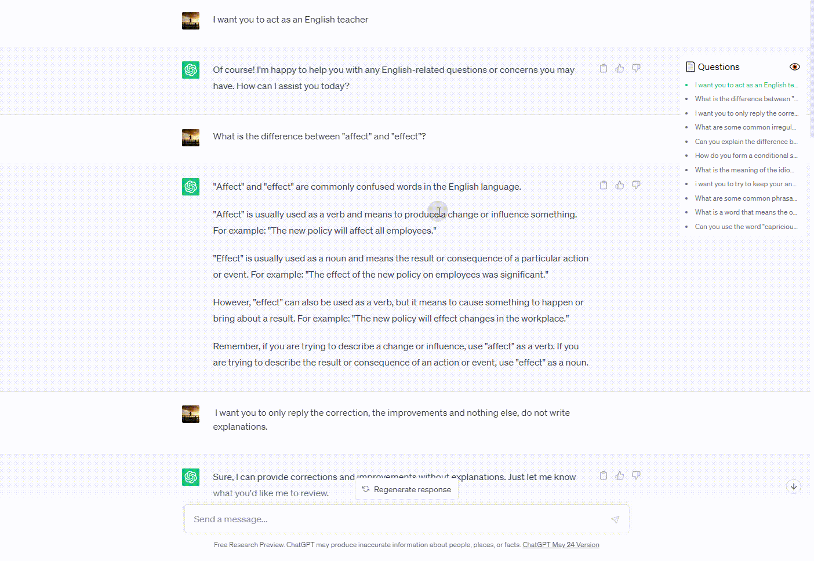

# ChatGPT Question Navigator

It provides a convenient question sidebar directory for the ChatGPT official website. It automatically collects the questions asked by users on the current session page and displays them on the sidebar, enabling quick navigation to the location of historical questions.

## Usage

[Install by Greasy Fork](https://greasyfork.org/zh-CN/scripts/467387-chatgpt-question-navigation-sidebar)

## Demo

